# Firmware architecture

This document describes the internal source layout of the firmware, the responsibility of each module, and how they depend on each other. It complements [README.md](README.md) (project overview) and [CONFIGURATION.md](CONFIGURATION.md) (user-facing setup).

## Goals behind the layout

- Keep `main.c` thin: boot sequence, main loop, and the time-critical Game Boy ISR only - and keep it free of any implementation-specific (cyw43/lwIP/ESP/etc.) knowledge.
- Isolate all libmobile glue code (the `mobile_impl_*` callbacks) in one place.
- Keep the network transport behind a small abstract interface (`net/net_hal.h` + `net/socket_hal.h`), so `main.c` and the adapter glue never call `cyw43_*`/`lwip_*`/ESP-AT-specific code directly. Porting to a different transport only requires a new backend under `src/implementations/` implementing those two headers - see `esp` (Pico + ESP8266EX over UART) for a second, independent implementation of the same contract.
- Split the web configuration server into a generic HTTP engine plus one file per group of routes, instead of one large file mixing HTTP parsing with business logic. The web UI itself is optional and owned by whichever implementation provides it (both `picow` and `esp` do today).

## The core/implementation split

`src/` (outside `src/implementations/`) is the **core**: everything the Mobile Adapter GB protocol, the Game Boy link cable, and persistent configuration need, regardless of which connectivity hardware the board uses. It compiles for any RP2040/RP2350 board and must never include a cyw43/lwIP/ESP-specific header directly.

`src/implementations/<name>/` is a **backend**: the concrete network transport, LED wiring, and (optionally) a web setup UI for one specific piece of connectivity hardware. There are two today:

- `picow` - cyw43 + lwIP, for Pico W / Pico 2 W (onboard Wi-Fi).
- `esp` - a plain Pico / Pico 2 talking to an external ESP8266EX (ESP-01) over UART, using ESP-AT as the Wi-Fi/TCP-IP modem (see [src/implementations/esp/README.md](../src/implementations/esp/README.md)).

Adding a third one means writing a new `src/implementations/<name>/` that implements the same `net_hal.h`/`socket_hal.h`/`led_hal.h` contract - it never requires copying or modifying core, PIO, or storage code.

## Directory tree

```text
src/
├── main.c                    # boot sequence, main loop, Game Boy link-cable ISR
├── globals.h                 # shared constants, struct mobile_user, LED/time macros
│
├── core/
│   ├── adapter_bridge.c/.h   # every mobile_impl_*() callback used by libmobile
│   │                         # (serial enable/disable, config read/write, timers,
│   │                         # socket open/close/connect/send/recv, number updates)
│   ├── led_status.c/.h       # boot/error LED indicator (see doc/CONFIGURATION.md)
│   ├── led_hal.h             # LED control contract implemented per-implementation
│   └── sync.c/.h             # lightweight core0/core1 handshake primitive
│
├── net/
│   ├── net_hal.h             # board-agnostic network interface (net_init, net_wifi_*,
│   │                         # net_poll, net_service_pending_socket_closes)
│   └── socket_hal.h          # opaque per-connection socket handle + open/close/connect/
│                             # send/recv/listen/accept contract, implemented per-backend
│
├── storage/
│   └── flash_eeprom.c/.h     # flash-backed persistence (config EEPROM blob,
│                             # Wi-Fi SSID/password), with mirrored save regions
│
├── pio/
│   ├── linkcable.c/.h         # Game Boy link-cable driver (PIO-backed)
│   ├── linkcable.pio          # REON pinout PIO program
│   └── linkcable_sm.pio       # StackSmashing pinout PIO program
│
└── implementations/
    ├── picow/                 # cyw43 + lwIP backend (Pico W / Pico 2 W)
    │   ├── CMakeLists.txt      # owns this backend's own dependencies (cyw43/lwIP)
    │   ├── lwipopts.h
    │   ├── led_hal_picow.c     # implements core/led_hal.h via cyw43_arch_gpio_*()
    │   ├── net/
    │   │   ├── picow_net.c/.h    # Wi-Fi connect/AP/status, implements net_hal.h
    │   │   ├── picow_socket.c/.h # lwIP TCP/UDP callbacks (recv/sent/accept/err)
    │   │   └── socket_impl.c/.h  # concrete struct socket_impl + socket_hal.h contract
    │   └── web/                  # optional: this backend's web setup UI
    │       ├── web_server.h      # public API: web_config_start/stop/run_blocking
    │       ├── web_internal.h    # struct web_conn (wraps a live lwIP tcp_pcb) + helpers
    │       ├── web_http.c        # HTTP engine: lwIP accept/recv/sent callbacks,
    │       │                     # request parsing, response framing, route dispatch
    │       ├── web_page.c/.h     # the static HTML/JS for the config page
    │       ├── web_routes.h      # route handler prototypes
    │       ├── web_routes_config.c  # GET/POST /api/config
    │       ├── web_routes_eeprom.c  # GET/POST /api/eeprom (raw 512-byte EEPROM blob)
    │       └── web_routes_misc.c    # POST /api/format, POST /api/reboot
    │
    └── esp/                    # Pico/Pico 2 + ESP8266EX (ESP-01, ESP-AT) backend
        ├── CMakeLists.txt      # owns this backend's own dependencies (hardware_uart)
        ├── README.md           # ESP-AT command set, pinout, baud rate, known limitations
        ├── led_hal_esp.c       # implements core/led_hal.h via a plain GPIO
        ├── net/
        │   ├── esp_config.h      # centralized pin/baud/timeout configuration
        │   ├── esp_uart.c/.h     # IRQ-driven UART ring buffer (no lost async events)
        │   ├── esp_at.c/.h       # the ESP-AT command/response/event engine - the only
        │   │                     # file that speaks the AT protocol
        │   ├── esp_net.c         # implements net_hal.h on top of esp_at.h
        │   └── socket_impl.c/.h  # concrete struct socket_impl + socket_hal.h contract,
        │                         # maps mobile connections to ESP-AT link IDs
        └── web/                  # optional: this backend's web setup UI (same routes/
                                   # HTML as picow's, copied rather than shared - see
                                   # esp/README.md; transport is polling-driven, not
                                   # callback-driven, since ESP-AT has no callbacks)
            ├── web_server.h, web_internal.h, web_http.c
            ├── web_page.c/.h
            └── web_routes.h, web_routes_config.c, web_routes_eeprom.c, web_routes_misc.c
```

## Module responsibilities and dependency direction

```mermaid
graph TD
    main[main.c] --> net_hal[net/net_hal.h]
    main --> socket_hal[net/socket_hal.h]
    main --> adapter_bridge[core/adapter_bridge.h]
    main --> linkcable[pio/linkcable.h]
    main --> flash_eeprom[storage/flash_eeprom.h]
    main -.optional, PICOADAPTER_HAS_WEB.-> web_server["implementations/*/web/web_server.h"]

    adapter_bridge --> socket_hal

    net_picow["implementations/picow/net/picow_net.c"] -->|implements| net_hal
    socket_impl_picow["implementations/picow/net/socket_impl.c"] -->|implements| socket_hal
    net_picow --> socket_impl_picow

    net_esp["implementations/esp/net/esp_net.c"] -->|implements| net_hal
    socket_impl_esp["implementations/esp/net/socket_impl.c"] -->|implements| socket_hal
    net_esp --> esp_at["implementations/esp/net/esp_at.c"]
    socket_impl_esp --> esp_at
    esp_at --> esp_uart["implementations/esp/net/esp_uart.c"]

    led_status[core/led_status.c] --> led_hal[core/led_hal.h]
    led_hal_picow["implementations/picow/led_hal_picow.c"] -->|implements| led_hal
    led_hal_esp["implementations/esp/led_hal_esp.c"] -->|implements| led_hal

    web_http_picow["implementations/picow/web/web_http.c"] --> web_routes_picow["implementations/picow/web/web_routes.h"]
    web_routes_impl_picow["implementations/picow/web/web_routes_*.c"] --> flash_eeprom
    web_routes_impl_picow --> web_internal_picow["implementations/picow/web/web_internal.h"]

    web_http_esp["implementations/esp/web/web_http.c"] --> web_routes_esp["implementations/esp/web/web_routes.h"]
    web_http_esp --> esp_at
    web_routes_impl_esp["implementations/esp/web/web_routes_*.c"] --> flash_eeprom
    web_routes_impl_esp --> web_internal_esp["implementations/esp/web/web_internal.h"]
```



- `main.c` only ever includes `net/net_hal.h`, `net/socket_hal.h`, `core/adapter_bridge.h`, `core/led_status.h`, `storage/flash_eeprom.h`, `pio/linkcable.h`, and - only when the selected implementation defines `PICOADAPTER_HAS_WEB` at compile time - `web/web_server.h` (resolved via that implementation's own include path). It has no knowledge of cyw43/lwIP, of libmobile's callback signatures, or of whether a web UI exists at all. Web shutdown is decided in the single main loop after `mobile_loop()` accepts the Start Session command; this firmware does not run a second core.
- `core/adapter_bridge.c` is the only place that implements the `mobile_impl_*()` callbacks and registers them via `mobile_def_*()`. Its socket callbacks call the `net/socket_hal.h` contract (`socket_impl_open/close/connect/send/recv/listen/accept`) through an opaque `struct socket_impl *` handle - it never sees the concrete lwIP-backed struct.
- `struct mobile_user` (in `globals.h`) holds `struct socket_impl *socket[MOBILE_MAX_CONNECTIONS]` - pointers to a type only the selected implementation defines. `net/socket_hal.h` forward-declares `struct socket_impl` as incomplete on purpose, so a stray field access from core code is a compile error, not a runtime bug. `socket_hal_bind()` (called once at boot) and `socket_hal_reset()` let core allocate/reset connections without knowing their layout.
- `core/led_hal.h` is the same pattern applied to the single status LED: `globals.h`'s `LED_ON`/`LED_OFF`/`LED_TOGGLE` macros resolve to `led_hal_set()`/`led_hal_get()`, and only the implementation knows whether that's a cyw43 GPIO or a plain RP2040/RP2350 GPIO.
- `net/net_hal.h` and `net/socket_hal.h` together are the seam for a backend swap: `src/implementations/picow/` implements both using cyw43 + lwIP, and `src/implementations/esp/` implements the same two contracts against ESP-AT over UART instead (see [src/implementations/esp/README.md](../src/implementations/esp/README.md) - notably, `esp`'s socket callbacks are all non-blocking/asynchronous the way libmobile itself expects, since ESP-AT command round-trips can take multiple seconds and there is no callback mechanism to lean on the way lwIP provides one).
- `implementations/picow/web/` and `implementations/esp/web/` are each a self-contained HTTP server: `web_http.c` owns connection lifecycle and request parsing and knows nothing about what each route does; `web_routes_*.c` files know about libmobile config and flash persistence, but not about TCP/HTTP framing (they call into `web_internal.h` helpers for that). Both are entirely optional - see `PICOADAPTER_HAS_WEB` above. The two implementations' `web_routes_*.c`/`web_page.c` files are byte-for-byte copies of each other rather than a shared module: they have zero transport dependency (verified - neither includes lwIP or ESP-AT headers), but `picow`'s `struct web_conn` wraps a live lwIP `tcp_pcb *` while `esp`'s wraps an ESP-AT link ID, so `web_internal.h` itself can't be shared, and the project's implementations are kept independent of each other (no `esp` → `picow` or `picow` → `esp` dependency) rather than introducing a third shared web module for a few hundred lines.

## Known coupling / limitation

`implementations/picow/net/picow_socket.c`'s lwIP callbacks (`socket_recv_tcp`, `socket_sent_tcp`, etc.) locate the connection's state via `mobile->currentReqSocket` (the index of whichever connection `core/adapter_bridge.c` last touched) rather than the callback's own lwIP `arg` parameter. This is pre-existing, working behavior specific to the picow backend, not part of the `net_hal.h`/`socket_hal.h` contract - a different backend is free to use its own connection-lookup strategy.

`implementations/esp/` shares a single ESP-AT `AT+CIPSERVER` slot (the ESP8266 only supports one at a time) between the web setup UI and libmobile's own TCP listen/accept (P2P). This works because the existing boot sequence already tears the web server down shortly after a Game Boy session starts, before libmobile would ever call `socket_impl_listen()` - see `src/implementations/esp/README.md` for the full reasoning and its limits.

## Build system note

Each implementation's `CMakeLists.txt` collects its own sources with `file(GLOB_RECURSE ...)` over its own directory, plus every `.c` file under `src/` outside `src/implementations/` (the shared core). New files anywhere under `src/` are picked up automatically **the next time CMake is reconfigured** - just re-running `ninja -C build` after adding/moving files is not enough; CMake needs to reconfigure (`cmake -S . -B build`) to re-scan the globs and regenerate the link command.

`src/` (core) and the selected implementation's own directory are both on the include path, so any file can include a core header with a path relative to `src/`, e.g. `#include "storage/flash_eeprom.h"` or `#include "net/net_hal.h"`. A file inside an implementation directory can include another file in the *same* subdirectory by its bare filename (e.g. `esp/net/socket_impl.c` including `"esp_at.h"`), but a cross-subdirectory include within the same implementation needs a path relative to the implementation root (e.g. `esp/web/web_http.c` including `"net/esp_at.h"`), the same way core files use paths relative to `src/`.

See [BUILDING.md](BUILDING.md) for how `PICO_BOARD`, `PICOADAPTER_IMPLEMENTATION`, and `ADAPTER` combine to select and name a build.
