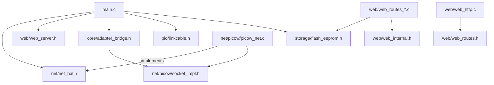

# Firmware architecture

This document describes the internal source layout of the Pico W firmware under `picow/src/`, the responsibility of each module, and how they depend on each other. It complements [README.md](README.md) (project overview) and [CONFIGURATION.md](CONFIGURATION.md) (user-facing setup).

## Goals behind the layout

- Keep `main.c` thin: boot sequence, main loop, and the time-critical Game Boy ISR only.
- Isolate all libmobile glue code (the `mobile_impl_*` callbacks) in one place.
- Keep the network transport behind a small abstract interface, so `main.c` and the adapter glue never call `cyw43_*`/`lwip_*` directly. Porting to a different transport (e.g. a plain Pico + ESP32 over UART/SPI) should only require a new backend behind that interface.
- Split the web configuration server into a generic HTTP engine plus one file per group of routes, instead of one large file mixing HTTP parsing with business logic.

## Directory tree

```text
picow/src/
├── main.c                    # boot sequence, main loop, Game Boy link-cable ISR
├── globals.h                 # shared constants, struct mobile_user, LED/time macros
│
├── core/
│   ├── adapter_bridge.c/.h   # every mobile_impl_*() callback used by libmobile
│   │                         # (serial enable/disable, config read/write, timers,
│   │                         # socket open/close/connect/send/recv, number updates)
│   └── led_status.c/.h       # boot/error LED indicator (see doc/CONFIGURATION.md)
│
├── net/
│   ├── net_hal.h             # board-agnostic network interface (net_init, net_wifi_*,
│   │                         # net_poll, net_service_pending_socket_closes)
│   └── picow/                # current cyw43 + lwIP backend implementing net_hal.h
│       ├── picow_net.c/.h    # Wi-Fi connect/AP/status, implements net_hal.h
│       ├── picow_socket.c/.h # lwIP TCP/UDP callbacks (recv/sent/accept/err)
│       └── socket_impl.c/.h  # per-connection socket state machine used by
│                             # adapter_bridge's impl_sock_*() callbacks
│
├── storage/
│   └── flash_eeprom.c/.h     # flash-backed persistence (config EEPROM blob,
│                             # Wi-Fi SSID/password), with mirrored save regions
│
├── web/
│   ├── web_server.h          # public API: web_config_start/stop/run_blocking
│   ├── web_internal.h        # struct web_conn + shared parsing/response helpers
│   ├── web_http.c            # HTTP engine: connections, request parsing,
│   │                         # response framing, route dispatch
│   ├── web_page.c/.h         # the static HTML/JS for the config page
│   ├── web_routes.h          # route handler prototypes
│   ├── web_routes_config.c   # GET/POST /api/config
│   ├── web_routes_eeprom.c   # GET/POST /api/eeprom (raw 512-byte EEPROM blob)
│   └── web_routes_misc.c     # POST /api/format, POST /api/reboot
│
└── pio/
    ├── linkcable.c/.h         # Game Boy link-cable driver (PIO-backed)
    ├── linkcable.pio          # REON pinout PIO program
    └── linkcable_sm.pio       # StackSmashing pinout PIO program
```

## Module responsibilities and dependency direction



- `main.c` only ever includes `net/net_hal.h`, `web/web_server.h`, `core/adapter_bridge.h`, `storage/flash_eeprom.h` and `pio/linkcable.h`. It has no knowledge of cyw43/lwIP or of libmobile's callback signatures. Web shutdown is decided on core0 after `mobile_loop()` accepts the Start Session command; it is not a cross-core watchdog path.
- `core/adapter_bridge.c` is the only place that implements the `mobile_impl_*()` callbacks and registers them via `mobile_def_*()`. It depends on `net/picow/socket_impl.h` for the actual socket operations.
- `net/net_hal.h` is the seam for a future backend swap. Everything under `net/picow/` implements it using cyw43 + lwIP; a hypothetical `net/esp32/` backend would implement the same six functions.
- `web/` is a self-contained HTTP server: `web_http.c` owns connection lifecycle and request parsing and knows nothing about what each route does; `web_routes_*.c` files know about libmobile config and flash persistence, but not about TCP/HTTP framing (they call into `web_internal.h` helpers for that).

## Known coupling / limitation

`struct mobile_user` (in `globals.h`) embeds `struct socket_impl` directly, and that struct contains a `union { struct tcp_pcb *tcp_pcb; struct udp_pcb *udp_pcb; }` from lwIP. This means the per-connection socket state is still tied to the lwIP backend at the struct level, even though `main.c` itself no longer references it directly. A full backend swap (e.g. to an ESP32-based transport) would need this field to become an opaque per-connection handle (e.g. `void *impl_state[MOBILE_MAX_CONNECTIONS]`), with each backend owning its own concrete type.

## Build system note

`picow/CMakeLists.txt` collects sources with `file(GLOB_RECURSE SOURCES "${CMAKE_CURRENT_SOURCE_DIR}/src/*.c")`, so new files anywhere under `picow/src/` (including new subfolders) are picked up automatically **the next time CMake is reconfigured**. Just re-running `ninja -C build` after adding/moving files is not enough — CMake needs to reconfigure (`cmake -S . -B build`) to re-scan the glob and regenerate the link command.

`picow/src` itself is on the include path (in addition to `picow/` and the workspace root), so any file can include another with a path relative to `picow/src/`, e.g. `#include "storage/flash_eeprom.h"` or `#include "net/net_hal.h"`, regardless of which subfolder it's in.
